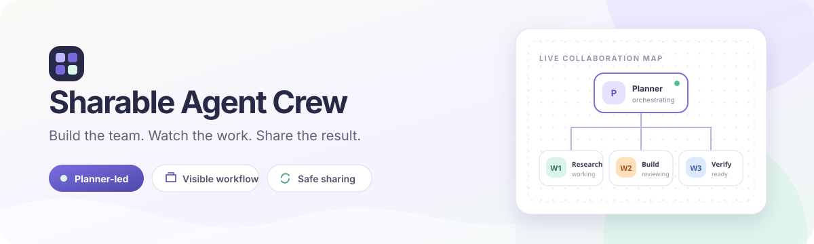
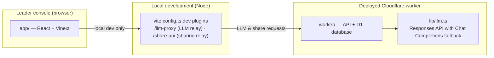

<p align="center">
  
</p>

<h1 align="center">Sharable Agent Crew</h1>

<p align="center">
  <strong>Build a Planner + Workers team, watch every collaboration phase, and share an immutable runnable version.</strong>
</p>

<p align="center">
  <a href="https://github.com/Taxueovo/Sharable-Agent-Crew/actions/workflows/ci.yml"></a>
  <a href="https://www.typescriptlang.org/"></a>
  <a href="https://react.dev/"></a>
  <a href="https://workers.cloudflare.com/"></a>
  <a href="LICENSE"></a>
</p>

<p align="center">
  <a href="#quick-start">Quick start</a>
  · <a href="#features">Features</a>
  · <a href="#architecture">Architecture</a>
  · <a href=".github/SECURITY.md">Security</a>
  · <a href="CONTRIBUTING.md">Contributing</a>
</p>

---

Sharable Agent Crew turns a multi-agent run into something you can understand and
share. Define one Planner and any number of Workers, follow the visible flow from
planning to final review, intervene when the team needs a correction, then publish a
read-only version by link and access code. Run history stays available for continuation.

| Assemble | Observe | Share |
| :--- | :--- | :--- |
| Give every agent a clear responsibility, working style, and tool set. | Follow **Planning → Working → Review → Final summary** and replan at any time. | Publish immutable versions that recipients can run but never silently modify. |

> **Built for controlled collaboration.** The conversation is orchestrated server-side,
> shared configurations are reloaded from D1, and task content is not written into the
> published team definition.

## Table of Contents

- [Authors & Maintainers](#authors--maintainers)
- [Features](#features)
- [Architecture](#architecture)
- [Task attachments](#task-attachments)
- [Prerequisites](#prerequisites)
- [Quick Start](#quick-start)
- [Environment Variables](#environment-variables)
- [Scripts](#scripts)
- [Deploy to the Owner's Cloudflare Account](#deploy-to-the-owners-cloudflare-account)
- [One-click Local Launch](#one-click-local-launch)
- [Included Shape](#included-shape)
- [Workspace Auth Headers](#workspace-auth-headers)
- [Optional Dispatch-Owned ChatGPT Sign-In](#optional-dispatch-owned-chatgpt-sign-in)
- [Learn More](#learn-more)

## Authors & Maintainers

- **Taxueovo** — core maintainer and primary developer.

## Features

- **Custom team building** — A team always uses the two-role template: one Planner and
  any number of Workers. Each member's name, responsibility, and way of working are
  defined by you; no preset "researcher" or "analyst" roles.
- **Explicit collaboration conversation** — The run follows a visible flow:
  Planning → Working → Discussion/Review → Final summary. At any point during a run you
  can intervene ("replan") with new directions, requirements, or corrections, and the
  Planner adjusts accordingly.
- **Controlled evolution** — After a run, the Planner can review the collaboration and
  propose improvements to agent responsibilities. Suggestions are applied only to the
  current draft; nothing is ever modified automatically.
- **Read-only sharing** — Publish a version of the team and share a link plus an access
  code. Recipients can run the team and see the conversation, but the members,
  responsibilities, architecture, and tools stay read-only. Publishing a new version
  never overwrites an older one.
- **Admin mode** — An optional admin token lets you list, deactivate, or permanently
  delete any version in the database, including ones shared by others.
- **Run history** — Every run's conversation is kept, and you can continue the
  conversation with the full context intact.
- **Task attachments** — See the [Task attachments](#task-attachments) section.
- **One-click local launch** — No system Node.js or administrator setup required on
  Windows; the launcher downloads a portable runtime on first start (see
  [One-click local launch](#one-click-local-launch)).

## Architecture



- **`app/api/conversation/route.ts`** — server-side conversation orchestrator. It
  owns phase order, actor selection, review and summarization, and streams only
  structured progress events to the browser. The browser cannot manufacture turns.
- **`lib/llm.ts`** — unified LLM call wrapper. Prefers the OpenAI Responses API
  (`/responses`); if the gateway returns 404 it automatically falls back to Chat
  Completions (`/chat/completions`) and caches the choice per worker isolate.
- **`PUBLIC_BASE_URL` in `vite.config.ts`** — used only by the development-time Node
  publishing relay. The deployed origin and `PUBLISH_TOKEN` are never bundled into
  browser code.
- **`vite.config.ts`** — two development-only plugins:
  - `llm-dev-proxy` — relays LLM requests from workerd (which cannot use an HTTP proxy)
    through a local Node endpoint that goes out via `HTTP_PROXY`/`HTTPS_PROXY`.
  - `share-api-proxy` — relays share-link creation/management requests from the local
    console to the deployed worker, because browsers cannot cross-origin reach
    `workers.dev` behind a corporate proxy/firewall.
  It also handles running from a network drive (polling watcher, state on the local
  temp drive).
- **`scripts/`** — the local launcher (`arbor-local-server.mjs`), a cross-platform
  wrapper around the vinext CLI (`run-vinext.mjs`), and the Windows portable-runtime
  bootstrap (`bootstrap-windows.ps1`).
- **Data** — Cloudflare D1 via Drizzle; schema in `db/schema.ts`, migrations in `drizzle/`.

## Task attachments

- Supported types: Word (`.docx`), Excel (`.xlsx` / `.xls`), CSV, TXT, Markdown, JSON,
  PNG, JPG, and WebP.
- Document and spreadsheet text is extracted in the browser and passed to the agents;
  it is never written into a published team template or D1, but it is sent to the
  configured model provider while the task is running.
- Images keep their preview and original data and are passed to the agents as
  multimodal input by default. Set `OPENAI_VISION_ENABLED=false` only when using a
  text-only model.
- Limits per task: up to 4 attachments, 10 MB per source document, 1.8 MB per image,
  3.5 MB of images in total, and 20 MB of selected source files in total.

## Prerequisites

- Node.js `>=22.13.0` (only needed when not using the one-click launcher, which
  downloads its own portable runtime)

## Quick Start

```bash
pnpm install --frozen-lockfile
pnpm run dev
pnpm run build
```

`pnpm run dev` starts the local Vinext dev server (the leader console) at
`http://localhost:3000`. LLM calls and share-link management are proxied through the
local Node dev server so they work behind corporate proxies without extra setup.

## Environment Variables

Copy `.env.example` to `.env` and fill in real values. `.env` is git-ignored.

| Variable                 | Required | Description                                                                                               |
| ------------------------ | -------- | --------------------------------------------------------------------------------------------------------- |
| `OPENAI_API_KEY`         | Yes      | API key for the LLM gateway.                                                                              |
| `OPENAI_BASE_URL`        | No       | Gateway base URL; defaults to `https://api.openai.com/v1`.                                                |
| `OPENAI_MODEL`           | No       | Model id; defaults to `gpt-5.6-luna`.                                                                     |
| `OPENAI_VISION_ENABLED`  | No       | Set to `false` to stop sending image attachments to the model (text-only models).                         |
| `PUBLIC_BASE_URL`        | Local publishing | HTTPS origin of the deployed worker used by the local owner-console relay.                     |
| `PUBLISH_TOKEN`          | Publishing | Server-to-server publishing secret; set both in the ignored local `.env` and as a Worker secret.       |
| `RUN_SESSION_SECRET`     | Deployed worker | Random secret of at least 32 characters used to sign guest run sessions and hash rate-limit identities. |
| `RUN_SESSION_SECRET_PREVIOUS` | Rotation only | Previous signing secret accepted temporarily while one-hour sessions drain. |
| `RUN_SESSION_SECRET_ID`  | No | Non-secret identifier for the current signing key. |
| `MAX_TEAM_RUNS_PER_MONTH` | No | Per-shared-team monthly run ceiling; defaults to 1000. |
| `MAX_TEAM_OUTPUT_TOKENS_PER_DAY` | No | Per-shared-team daily reserved output-token ceiling; defaults to 200000. |
| `REQUIRE_AUTHENTICATED_PUBLISHER` | No | Set to `1` to require ChatGPT/Cloudflare Access identity for publishing. |
| `ARBOR_IDLE_MINUTES`     | No       | Idle timeout (minutes) for the one-click local launcher; defaults to 30.                                   |
| `ADMIN_TOKEN`            | No       | Admin password for the "Share & Permissions" admin mode. **Do not put it in a distributed `.env`** — set it on Cloudflare with `npx wrangler secret put ADMIN_TOKEN`. |
| `ARBOR_NETWORK_DRIVE`    | No       | Set to `1` when the project lives on a network drive (e.g. a shared drive or UNC path): switches Vite to polling and redirects cache/state to the local temp drive. Injected by the launcher when needed. |
| `ARBOR_DEV_PROXY_URL`    | No       | Development-only URL of the local LLM relay; injected automatically by the launcher with the actual port.  |

## Scripts

| Script                     | Description                                                                  |
| -------------------------- | ---------------------------------------------------------------------------- |
| `pnpm run dev`              | Start the local development server.                                          |
| `pnpm run local`            | Start the one-click-style local launcher on port 3000.                       |
| `pnpm run build`            | Build with vinext and verify the output.                                     |
| `pnpm run start`            | Serve a previously built output.                                             |
| `pnpm test`                 | Build, then run the server-render smoke test.                                |
| `pnpm run lint`             | ESLint over the project.                                                     |
| `pnpm run db:generate`      | Generate Drizzle migrations after schema changes.                            |
| `pnpm run db:migrate:cloudflare` | Apply migrations to the remote D1 database.                             |
| `pnpm run deploy:cloudflare`     | Build and deploy the worker to Cloudflare.                              |
| `pnpm run release:check`         | Run the complete public-release gate, including an isolated local D1.   |

## Deploy to the Owner's Cloudflare Account

```bash
cp wrangler.deploy.example.jsonc wrangler.deploy.jsonc
# Fill in only the D1 database ID; do not put secrets in this file.
pnpm exec wrangler login
pnpm run build
pnpm run db:migrate:cloudflare
pnpm exec wrangler secret put OPENAI_API_KEY --config wrangler.deploy.jsonc
pnpm exec wrangler secret put RUN_SESSION_SECRET --config wrangler.deploy.jsonc
pnpm exec wrangler secret put PUBLISH_TOKEN --config wrangler.deploy.jsonc
# Optional operations console:
pnpm exec wrangler secret put ADMIN_TOKEN --config wrangler.deploy.jsonc
pnpm run deploy:cloudflare
```

The Cloudflare account, worker name, and D1 bindings live in `wrangler.deploy.jsonc`,
created from the committed example. Keep the real file private if its account identifiers
are sensitive. Secrets are installed individually and are never bundled into browser code.

For the local owner console, put `PUBLIC_BASE_URL` and the same `PUBLISH_TOKEN` in the
ignored `.env`. `PUBLISH_TOKEN` authorizes the local server-to-server publishing relay;
`RUN_SESSION_SECRET` signs short-lived guest run sessions and must be a different random
value. Generate each with a cryptographically secure password manager or `openssl rand -hex 32`.
For rotation, move the old signing value to `RUN_SESSION_SECRET_PREVIOUS`, install
the new `RUN_SESSION_SECRET`, change `RUN_SESSION_SECRET_ID`, deploy, wait longer
than the one-hour session TTL, then remove the previous secret.

## Security and privacy boundary

- Public users cannot call individual phases. `/api/access` issues a one-hour signed
  run capability, and `/api/conversation` rechecks D1 then owns the entire phase sequence.
- The server ignores client-supplied team definitions for public sessions and reloads the
  immutable team configuration from D1.
- Model calls have minute, monthly-run, daily-output-token limits, a short upstream
  circuit breaker, and strict task/transcript/attachment/image-size caps.
- Structured logs contain request id, route, outcome, duration and turn count only;
  prompts, transcript text and attachment names/content are excluded.
- Usage records retain event counts only. User task text and attachment contents are not
  written to D1; migration `0002_lumpy_cerebro.sql` redacts old log content.
- Task text, extracted attachment content and enabled images are transmitted to the
  configured model provider to produce answers. Do not submit data that the provider's
  policy or your organization's policy forbids; use an approved endpoint and retention policy.
- Owner/access/admin bearer credentials use session storage only and disappear when the
  browser tab closes. Never include credentials in issue reports, screenshots or URLs.
- The local LLM relay permits only the configured gateway origin and the two expected API
  paths. It is not a general-purpose HTTP proxy.

## One-click Local Launch

- **macOS**: double-click the included `.command` launcher in the delivered project
  folder.
- **Windows**: double-click the included `.bat` launcher. The first launch downloads a
  portable Node.js runtime inside the project (`.arbor-runtime/`), installs
  Windows-native dependencies, reads the included `.env`, starts SharableAgentCrew, and opens the
  browser. No system-wide Node.js installation and no administrator setup required.
- The launcher automatically stops the local server and frees the port after 30 minutes
  without browser interaction (or about 10 seconds after the browser closes, leaving a
  short grace period for page refreshes). Set `ARBOR_IDLE_MINUTES` in `.env` to change
  the idle timeout.
- The launcher reads the project `.env` if present (see `.env.example`); create it from
  `.env.example` and fill in your own API key before first use.

## Included Shape

This project is based on the Vinext "site-creator" starter shape:

- Edit site code under `app/`
- `.openai/hosting.json` declares optional Sites D1 and R2 bindings
- `vite.config.ts` simulates declared bindings for local development
- `db/schema.ts` starts intentionally empty
- `examples/d1/` contains an optional D1 example surface
- `drizzle.config.ts` supports local migration generation when needed

## Workspace Auth Headers

Signed-in visitors receive both `oai-authenticated-user-id` and
`oai-authenticated-user-email`. Private Sites require every visitor to sign in; public
Sites may also have anonymous visitors, for whom neither header is present.

The user ID is stable for the same user on the same Site and different across Sites.
Email and name are intended for display or contact purposes.

SIWC-authenticated workspace sites may also receive
`oai-authenticated-user-full-name` when the user's SIWC profile has a non-empty `name`
claim. The full-name value is percent-encoded UTF-8 and is accompanied by
`oai-authenticated-user-full-name-encoding: percent-encoded-utf-8`.

Treat the full name as optional and fall back to email when it is absent:

```tsx
import { headers } from "next/headers";

export default async function Home() {
  const requestHeaders = await headers();
  const userId = requestHeaders.get("oai-authenticated-user-id");
  const email = requestHeaders.get("oai-authenticated-user-email");
  const encodedFullName = requestHeaders.get("oai-authenticated-user-full-name");
  const fullName =
    encodedFullName &&
    requestHeaders.get("oai-authenticated-user-full-name-encoding") ===
      "percent-encoded-utf-8"
      ? decodeURIComponent(encodedFullName)
      : null;

  const displayName = fullName ?? email;
  // ...
}
```

## Optional Dispatch-Owned ChatGPT Sign-In

Import the ready-to-use helpers from `app/chatgpt-auth.ts` when the site needs optional
or required ChatGPT sign-in:

- Use `getChatGPTUser()` for optional signed-in UI.
- Use `requireChatGPTUser(returnTo)` for server-rendered pages that should send
  anonymous visitors through Sign in with ChatGPT.
- Use `chatGPTSignInPath(returnTo)` and `chatGPTSignOutPath(returnTo)` for browser
  links or actions.
- Pass a same-origin relative `returnTo` path for the destination after sign-in or
  sign-out. The helper validates and safely encodes it.
- Mark protected pages with `export const dynamic = "force-dynamic"` because they
  depend on per-request identity headers.

Dispatch owns `/signin-with-chatgpt`, `/signout-with-chatgpt`, `/callback`, the OAuth
cookies, and identity header injection. Do not implement app routes for those reserved
paths. Routes that do not import and call the helper remain anonymous-compatible.

SIWC establishes identity only; it does not prove workspace membership. Use the Sites
hosting platform's access policy controls for workspace-wide restrictions, or enforce
explicit server-side membership or allowlist checks.

Use SIWC for account pages, user-specific dashboards, saved records, and write actions
tied to the current ChatGPT user. Leave public content anonymous.

## Learn More

- [Vinext Documentation](https://github.com/cloudflare/vinext)
- [Drizzle D1 Guide](https://orm.drizzle.team/docs/get-started/d1-new)
